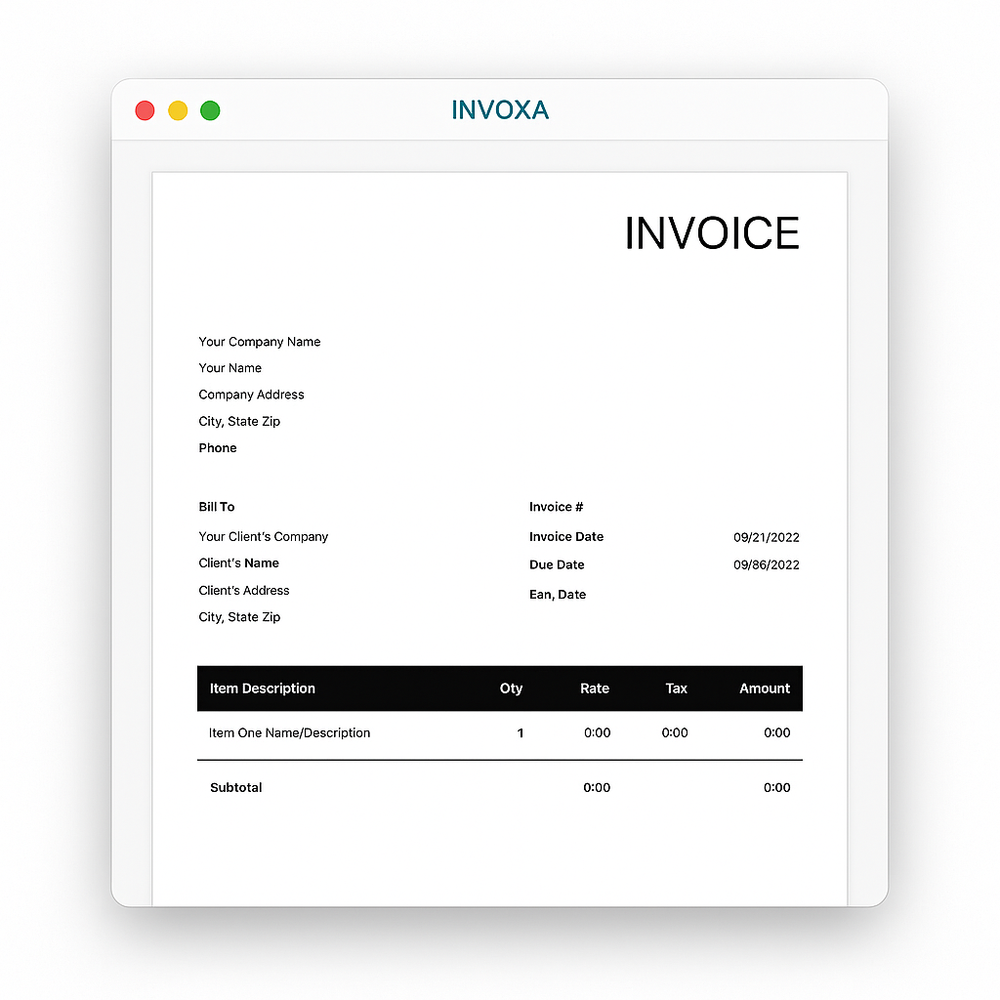

# INVOXA 

A fast, simple, and user-friendly invoice generator and manager built for freelancers, small businesses, and anyone who needs to handle professional billing efficiently.

## Features

- Create and customize professional invoices
- Track payments and due dates
- Export invoices as PDF
- Simple, intuitive UI for quick use

## Screenshot
<center>

</center>

##  Tech Stack

- Frontend: Reacr JS*
- Styles: Syntactically Awesome Style Sheets (SASS)
- AI Assistance: ChatGPT, Github Copilot

## Future Updates
I am continuously working to enhance the functionality of my Invoice App. Some of the planned updates include:
- Working on new UI Design for better Experience of Users.
- Adding Sign In/Sign Up Features for flexibility.
- Improved user interface with a history feature to view previous Invoices.
- Option to change themes and customize the Application as well as Invoice appearance.
- Ability to save and load Invoice Data in DataBase for later reference.

I appreciate your feedback and suggestions as I strive to make the INVOXA even better!

## Live App Demo

Check out the live demo [here](http://invoxa-six.vercel.app).


## Installation

Clone the repo:

```bash
git clone https://github.com/yourusername/invoice-app.git
cd invoice-app

